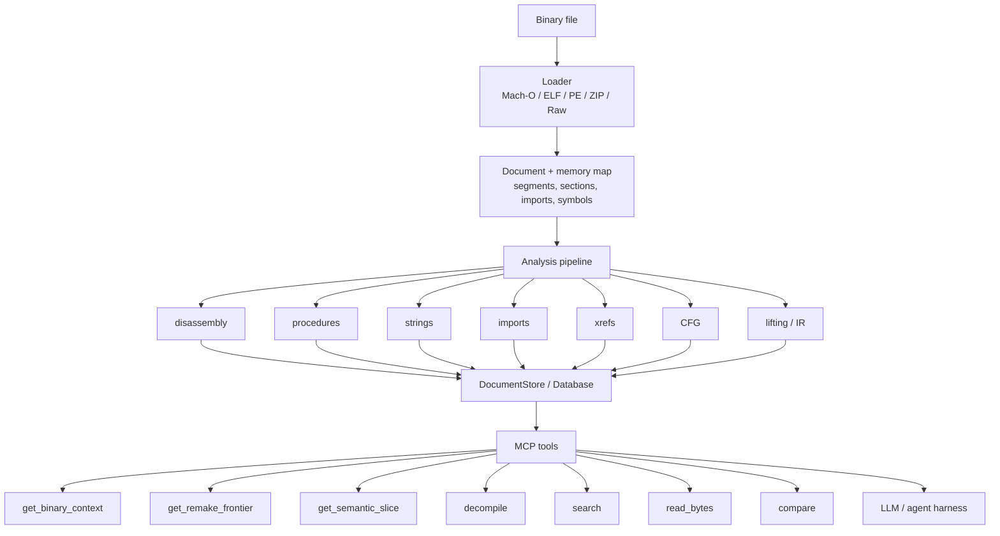

# Phora

[](LICENSE)
[](https://ziglang.org/)
[](https://modelcontextprotocol.io/)
[](#known-limitations)

Phora is an MCP-native binary analysis engine for agentic reverse engineering. It loads binaries, builds memory maps, extracts procedures, strings, imports, xrefs, and control-flow evidence, then exposes that evidence through bounded tool calls designed for LLM workflows. Instead of dumping an entire binary into context, Phora helps agents plan, divide, inspect, prove, and resume analysis.

This is an early public source snapshot. It is useful for review, experimentation, and MCP integration work, but it is not a polished public release yet.

Phora is released under CC0 1.0 Universal. No rights are reserved. You may copy, modify, distribute, and use it for any purpose, including commercial use, without asking permission.

## Why Phora

Phora is built around the idea that binary analysis should be split across agents instead of forced through one linear tool session. A harness can load one binary, compare several versions, or inspect many binaries at once, then fan out focused MCP calls across functions, imports, strings, raw bytes, and subsystem slices.

The important design choice is that Phora returns bounded, structured evidence. Tool results are JSON-shaped for MCP clients, and the higher-level tools are designed to produce useful next calls instead of dumping everything into one enormous response. That makes it practical for multiple agents to divide the work: one maps the binary, one follows call graph evidence, one checks strings and imports, one compares versions, and another drops to bytes or disassembly when the model needs proof.

Phora can also stay small. The release build is configured for a 2 MiB binary budget, while the dev-only benchmark lane checks JSON validity, core MCP behavior, strict self-analysis, and repeatable two-agent runs.

## Architecture



## Build

```sh
zig build
```

The release build is configured for a 2 MiB binary budget.

## Test

```sh
zig build test
zig build check-safe
zig build verify
```

Some integration tests inspect host-system binaries and may skip when expected local files are unavailable.

## Benchmark Harness

The dev-only MCP benchmark harness uses only the Python standard library and talks to Phora through `phora serve --stdio`.

```sh
python3 scripts/bench-phora.py --dry-run
python3 scripts/bench-phora.py --phora ./zig-out/bin/phora
python3 scripts/bench-phora.py --phora ./zig-out/bin/phora --case system-ls-auto-context --two-agent
```

Cases live in `benchmarks/cases.json`. Each case resolves the first available local target, skips cleanly when all target candidates are missing, records JSON validity, latency, MCP/tool errors, and scores expected clues in the returned analysis text.

Run reports are written by default under `benchmark-results/`, which is ignored and should remain untracked.

## MCP

Build Phora, then configure an MCP client with the stdio server:

```json
{
  "mcpServers": {
    "phora": {
      "command": "/absolute/path/to/phora/zig-out/bin/phora",
      "args": ["serve", "--stdio"]
    }
  }
}
```

Use `.mcp.example.json` as a template. Do not commit local `.mcp.json` files with machine-specific paths.

### MCP Tool Highlights

These are the tools that make Phora useful as an app/MCP combo for agentic analysis:

| Tool | Why it matters |
| --- | --- |
| `load_binary` | Loads one or more local binaries into Phora and returns the document IDs, detected format, architecture, entry point, and summary stats. |
| `get_binary_context` | First call after loading. It chooses a compact full view, a frontier plan, or a lightweight manifest based on binary size and shape. |
| `get_remake_frontier` | Ranks the next functions or subsystems to inspect and emits `parallel_batches` that a harness can hand to multiple agents. |
| `get_semantic_slice` | Compiles a function or cluster into LLM-ready facts, context packs, or structured remake/spec evidence. |
| `decompile` | Renders a coherent C-like translation unit for one function or a small related cluster. |
| `read_bytes` | Reads bounded raw bytes from mapped addresses when the model needs direct evidence. Length is capped at 64 KiB per call. |
| `search` | Searches names, strings, imports, calls, string references, capability markers, and static writers across one or all loaded documents. |
| `compare` | Diffs two loaded binaries by imports, strings, libraries, and optional procedure fingerprints for version-to-version analysis. |
| `suggest_names` + `annotate` | Supports the iterative workflow: gather naming evidence, apply names/comments/tags, then re-run context with better labels. |
| `save_project` + `load_project` | Persists analysis state so a later session can resume without re-running the whole load/analyze path. |

A typical swarm-style harness loop looks like this:

```text
load_binary path=/path/to/binary
get_binary_context doc_id=1 mode=auto
get_remake_frontier doc_id=1 goal="understand the update path"

# Fan out calls from parallel_batches:
get_semantic_slice doc_id=1 addresses=["0x..."] view=pack scope=cluster
decompile doc_id=1 address="0x..." scope=cluster
search doc_id=1 type=string_refs pattern="update|config|token"
read_bytes doc_id=1 address="0x..." length=256
```

## Known Limitations

- Phora is a public preview, not a polished release.
- Stdio is the recommended MCP transport.
- HTTP remains experimental until the request-arena leak is resolved.
- `read_bytes` returns bounded hex/ascii evidence from mapped addresses, not arbitrary memory.
- Benchmark results are sanity checks, not formal performance claims.
- Analysis depth varies by architecture, format, strippedness, and binary size.
- Integration tests and benchmarks may skip host-specific binaries.

## License

Phora is dedicated to the public domain under [CC0 1.0 Universal](LICENSE). Where a public-domain dedication is not fully recognized, CC0 provides a broad fallback license.

## Known-Answer Benchmarks

The dev-only benchmark lane exercises Phora through MCP against local binaries and skips cases whose targets are missing:

```sh
scripts/bench-phora.py --dry-run
scripts/bench-phora.py --case phora-self-context
scripts/bench-phora.py --two-agent --case phora-self-context --case system-ls-auto-context
```

Benchmark results are written under `benchmark-results/` and are intentionally ignored.

## Safe Source Export

This working directory contains local reports, generated artifacts, and binary samples that should not be pushed. Use the guarded export path instead:

```sh
scripts/github-safe-publish.sh
```

The default mode creates a sanitized source-only export repository and does not push. Pushing requires an explicit remote, `--push`, and an explicit visibility confirmation flag: `--confirm-public-repo` or `--confirm-private-repo`.
